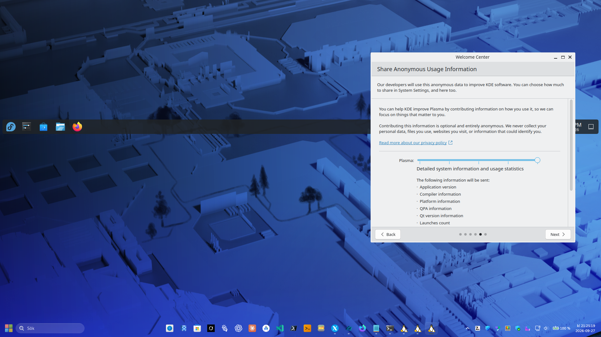

<p align="center">
  <a href="https://github.com/vinberg88/fedora">
    
  </a>
</p>

<h1 align="center">Fedora Linux on WSL</h1>
<p align="center"><strong>Your Linux desktop. Your Windows workspace.</strong><br />Desktop setups, screenshots and practical guides by Mattias Vinberg.</p>

<p align="center">
  
  
  
</p>

<p align="center">
  <a href="#-kde-plasma-6--fedora-44">KDE desktop</a> ·
  <a href="#-start-kde-with-x410">Start guide</a> ·
  <a href="#-desktop-collection">Desktop collection</a> ·
  <a href="https://github.com/vinberg88">More WSL projects</a>
</p>

## 💙 Welcome to Fedora

Fedora is a community-developed Linux distribution sponsored by Red Hat, built around free and open-source software. This repository brings together my Fedora desktop experiments on **Windows 11 with WSL 2** — with screenshots, installation notes and scripts you can use in your own setup.

The collection is intended to cover **Fedora 39–45**, with each desktop documented as it is added. The working setup below is **Fedora 44 with KDE Plasma 6**; the version range does not mean every release has been tested or is still supported.

## 🖥️ KDE Plasma 6 · Fedora 44

[](images/fedora44-kde6-x410.png)

<p align="center"><em>My Fedora 44 KDE Plasma 6 setup on Windows 11 — desktop startup confirmed working with the X410 launcher.</em></p>

A full Plasma desktop with a familiar panel, application launcher and plenty of room to make it your own. The launcher directs the KDE session to **X410** and uses the **WSLg audio socket** when available.

| Component | Setup |
| :--- | :--- |
| Linux distribution | Fedora 44 in WSL 2 |
| Desktop | KDE Plasma 6, X11 session |
| Display server | X410 running in Windows |
| Audio connection | WSLg PulseAudio socket |
| Launcher | `kde6-x410` · version 0.1.0 |
| Desktop startup | Confirmed working on my setup |

**[View the installer](install-kde6-x410-fedora44.sh)** · **[Download the installer](https://raw.githubusercontent.com/vinberg88/fedora/main/install-kde6-x410-fedora44.sh)**

## 🚀 Start KDE with X410

This is the **desktop startup step** for an existing Fedora 44 WSL installation with KDE Plasma installed. It is not a Fedora image builder or a complete base-installation guide.

Before starting, have **systemd enabled in WSL**, log in as your normal Linux user with `sudo` access, and start **X410 in Windows using Desktop mode**. X410 must allow connections from your WSL instance. Log out of any KDE session you already started manually.

### 1. Download and install the launcher

Run inside Fedora 44:

```bash
curl -fL https://raw.githubusercontent.com/vinberg88/fedora/main/install-kde6-x410-fedora44.sh -o install-kde6-x410-fedora44.sh
bash install-kde6-x410-fedora44.sh
```

Run the script **without `sudo`**. It requests elevated privileges when installing the required packages and launcher.

### 2. Check and start

```bash
kde6-x410 doctor
kde6-x410 start
```

**Start X410 first — every time you start the desktop.**

| Command | Purpose |
| :--- | :--- |
| `kde6-x410 doctor` | Check packages, X410, the audio socket and session status |
| `kde6-x410 start` | Start KDE Plasma on X410 |
| `kde6-x410 stop` | Request shutdown of the session started by this launcher |
| `kde6-x410 log` | Show the latest session log |

<details>
<summary><strong>Troubleshooting and configuration</strong></summary>

If X410 is not detected, check that it is running and that X410 access settings and Windows Firewall allow the WSL connection. To choose the display explicitly, substitute your Windows host address:

```bash
X410_DISPLAY=YOUR_WINDOWS_HOST_IP:0.0 kde6-x410 start
```

The launcher sets `General/systemdBoot=false` in your user's `startkderc` so Plasma uses its separate D-Bus session. An existing configuration is backed up on first start.

Logs and the configuration backup are stored under:

```text
~/.local/state/kde6-x410-fedora44/
```

If reporting a problem, include the output of `kde6-x410 doctor` and the relevant lines from `kde6-x410 log`.

</details>

## 🧩 Desktop collection

| Fedora | Desktop | Status | Guide |
| :--- | :--- | :--- | :--- |
| 44 | KDE Plasma 6 · X410 | ✅ Desktop startup tested | [Start guide](#-start-kde-with-x410) |

More desktop setups, detailed installation notes and video walkthroughs will be linked here as they are added.

---

<p align="center">
  <strong>Fedora freedom. Windows convenience.</strong><br />
  Built and tested by <a href="https://github.com/vinberg88">Mattias Vinberg</a><br />
  <sub>Personal community project · Not an official Fedora or Red Hat project.</sub>
</p>
